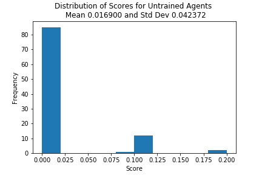
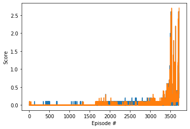
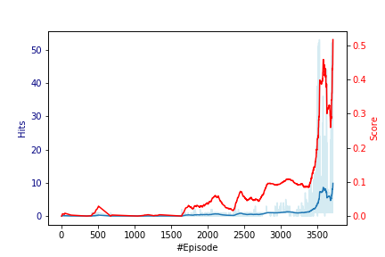
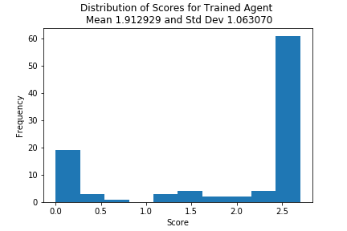

# Report 

## Baseline Evaluation
To evaluate the performance we performed a baseline test at the beginning of the project and run the environment N=100 times with random uniformly distributed actions. Below diagram shows the distribution with its mean and standard deviation from this experiment.

## Learning

