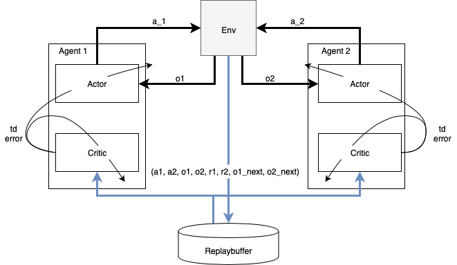
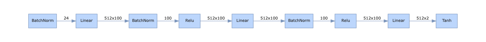
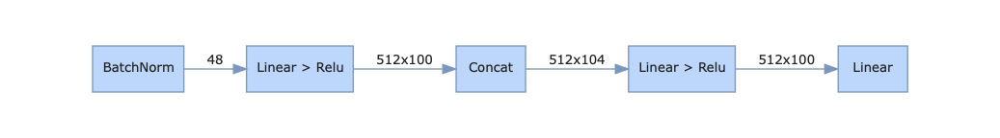

# Report 

## Baseline Evaluation
To be able to evaluate the performance of a trained agent we performed a baseline test at the beginning of the project and run the environment N=100 times with random uniformly distributed actions. Below diagram shows the distribution with its mean and standard deviation from this experiment.

## Learning Algorithm

### Algorithm
We implemented a Multi Agent Deep Deterministic Policy Gradient (MADDP) algorithm. This algorithm is described in detail in [this landmark paper](https://arxiv.org/abs/1706.02275). Key idea is the utilization of multiple actor-critic agents, in our case 2, where the critic networks are centralized, i.e. they take as inputs the actions, observations of all agents as well as the reward of the particular agent to approximate the expected value of total reward for the respective agent. The actor network takes only the observation of the respective agent as input to approximate the policy of the actor. Training is realized through TD-learning of actors and critics from batches of random samples of a replay buffer that is continuously updated with the latest 1000000 training samples.

This core part is implemented in the classes SingleAgent and MultiAgent.

### Actor Network Architecture
The actor network is a fully connected network with input layer the observation size 24 then followed by two layers of size 100 each and then followed by the output layer of the action space size 2. The input layer and the hidden layers are followed by a batch normalization and a relu-function, the output layer is mapped to the valid action range by a tanh-function.

The full network architecture details are vizualized below with an assumed batch size of 512:

### Critic Network Architecture
The critic network is a fully connected network with two input layers: The first input layer takes the full state vector, i.e. the observations of both agentss, to a fully connected layer with 100 nodes followed by a batch normalization and a relu-function. The result is concatenated with the action vector of boh agents and forms the input to a fully connected layer with 100 nodes. This layer is followed by a relu function 

The full network architecture details are vizualized below with an assumed batch size of 512:

### Hyperparameters

| Hyperparameter       | Value   |
|----------------------|---------|
| BUFFER_SIZE          | 1000000 |
| BATCH_SIZE           | 512     | 
| GAMMA                | 0.99    |       
| TAU                  | 1e-3    |         
| Learning Rate Actor  | 1e-3    |     
| Learning Rate Critic | 1e-3    |    
| WEIGHT_DECAY         | 0.0     | 
| EPSILON_START        | 1.0     |
| EPSILON_DECAY        | 0.9995  |
| EPSILON_END          | 0.00001 |
| LEARN_EVERY          | 20      |
| LEARN_TIMES          | 10      |
| PRIO_ALPHA           | 0.1     |

## Results
The goal of a score larger than 0.5 was achieved after approx. 3600 episodes. Due to the non-stationarity of the setup the average score over episodes does not follow a continuously increasing curve but rather stays almost constant zero for the first 1500 episodes end then increases significantly to approx. 0.1. At this point the players learned to successfully hit the first ball of the game. After approx. 3400 episodes there is another significant increment that reflect the point at which the agents learned to hit back balls from the other agents.

The red curve shows the average score per episode (defined as the max over the scores of the two agents) over the last 100 episodes. The dark blue curve shows the average number of hits of the best agent in ever episode over the last 100 episodes. The light blue bars indicate the number of hits of the best agent in every episode.

With the trained agents we performed the baseline experiment of 100 episodes again. The results are shown below.

## Ideas for Future Work
- Overall the agents performance seems to correlate with what seemingly is a "single trick", namely to play back the ball over the net. Once this is robustly learned the score increases significantly since this trick "only" needs to be repeated within an episode to achieve the maximum possible score. Thus, an analysis/classification of the situations where the ball was lost and boosting of successful similar situations where the ball was hit could help to improve the final performance

Further ideas are:
- Varation of hyperparameters, in part. to reduce the learning time
- Variation of network architecture possible also assymetric arcitectures
- Distributed training to improve the actual learning speed
- The movement of the agents is partly not very efficient and looks sometimes quite gawky. Introducing a penalty on high velocities and movements in general could help to streamline the reacting and hitting on incoming balls and in the course of this also improve the agents performance

Further (code) improvements to be taken up:
- make hyperparameters specific for every agent and more easily readible e.g. through a json file
- 

